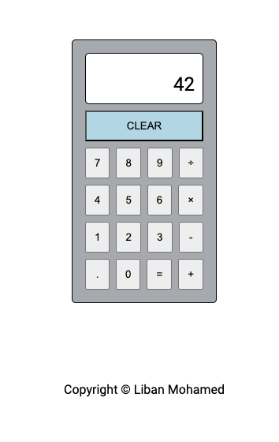

# Calculator App

## Overview
A simple calculator application built with HTML, CSS, and JavaScript. This project was created to practice basic JavaScript operations and DOM manipulation.

## Live Preview
You can try the live version of the Matrix Solver at the following link: [Calculator App Live Preview](https://kingliban.github.io/calculator/)

## Features
- Basic arithmetic operations (addition, subtraction, multiplication, division)
- Clear and delete functions
- Responsive design

